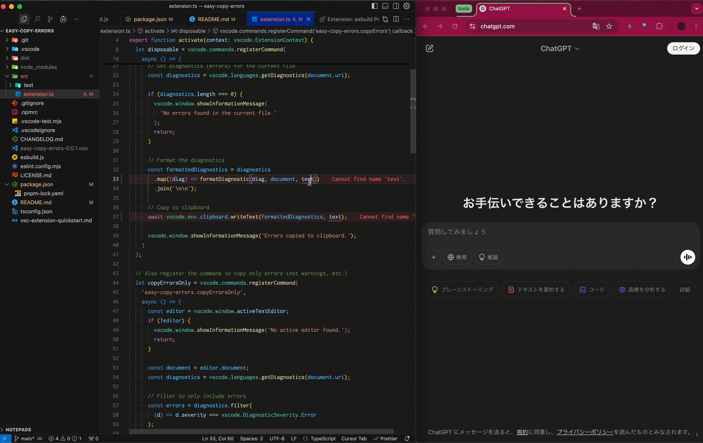

# 📋 Easy Copy Errors

[English](README.md) | [日本語](README.ja.md)

現在のファイルやターミナル出力からエラーメッセージを簡単にコピーするためのVS Code拡張機能です。
特に生成AI（ChatGPT、GitHub Copilotなど）へのプロンプト作成のために作りました。


## 🌟 特徴

2つのコマンドがあるので、それぞれ説明します。

### copyErrors
- 🔴 現在のファイル内のすべての診断情報（エラー、警告など）をコピー
- 📊 同様のエラーをグループ化して読みやすく表示
- 🔧 コピーされるエラーメッセージのフォーマットをカスタマイズ可能

### copyVitestResults (beta)

Vitestのテスト結果をコピーするコマンドです。
VSCodeのターミナルでVitestを実行した後に使用してください。
使用しているVitestのバージョンやテストの実行方法によっては、コピーできない可能性があるため、beta版としています。
- 🧪 失敗したVitestテスト結果を抽出して読みやすい形式でコピー
- 📋 テストファイルと特定のテストを選択してコピー
- 📝 コードスニペット、期待値/実際値、エラーメッセージを含む
- 🔍 様々なVitest出力形式に対応

## ⌨️ キーボードショートカット

| 機能 | Windows/Linux | macOS |
|------|---------------|-------|
| 診断情報のコピー | `Ctrl+Alt+E` | `Cmd+Option+E` |
| Vitestテスト結果のコピー | `Ctrl+Alt+T` | `Cmd+Option+T` |


## 🚀 使い方

### copyErrors

#### 使い方
1. コマンドパレット（`Ctrl+Shift+P`または`Cmd+Shift+P`）から「`Errors: Copy Diagnostics`」を実行
2. またはキーボードショートカット：`Ctrl+Alt+E`（Macの場合は`Cmd+Option+E`）を使用
3. 現在開いているファイルの診断情報がクリップボードにコピーされます

#### エラーのコピーに関する設定
- `easyCopyErrors.useNewFormat`: AI向けの新しいフォーマットを使用（デフォルト: `true`）
- `easyCopyErrors.includeFileName`: ファイル名を含める（デフォルト: `true`）
- `easyCopyErrors.format`: カスタムフォーマット（デフォルト: `"[${severity}] Line ${line}, Column ${column}: ${message}"`）
- `easyCopyErrors.useGrouping`: 類似エラーをグループ化（デフォルト: `true`）
- `easyCopyErrors.errorsOnly`: エラーのみをコピー、警告を除外（デフォルト: `false`）

#### フォーマット例
```
file: src/components/Button.tsx
Line 42:      return {label}
Property 'handlClick' does not exist. Did you mean 'handleClick'? ts(2551)
```

#### AIへの質問例
```
以下のTypeScriptのエラーを解決する方法を教えてください。

file: src/components/Button.tsx
Line 42:      return {label}
Property 'handlClick' does not exist. Did you mean 'handleClick'? ts(2551)
```

### copyVitestResults (beta)

#### 使い方
1. ターミナルでVitestテストを実行
2. コマンドパレット（`Ctrl+Shift+P`または`Cmd+Shift+P`）から「`Vitest: Copy Vitest Test Results`」を実行
3. またはキーボードショートカット：`Ctrl+Alt+T`（Macの場合は`Cmd+Option+T`）を使用
4. テストファイルと特定のテストを選択（デフォルトですべてのテストが選択されています）
5. 選択したテスト結果がクリップボードにコピーされます

#### Vitest出力のフォーマット例
```
file: src/components/Counter.test.ts

expected:
expected counter to equal 2

received:
Received:

  1st assertion:

  [
-   2,
+   1,
  ]


Number of calls: 1

code snippet:
test('increment increases the count by 1', () => {
  const counter = new Counter();
  counter.increment();
  expect(counter.value).toBe(2);
});

```

#### AIへの質問例
```
以下のVitestテスト失敗を修正する方法を教えてください。
Counterクラスの実装に問題があるようです。incrementメソッドが値を正しく増加させていない可能性があります。どのように修正すべきでしょうか？

file: src/components/Counter.test.ts

expected:
expected counter to equal 2

received:
Received:

  1st assertion:

  [
-   2,
+   1,
  ]

code snippet:
test('increment increases the count by 1', () => {
  const counter = new Counter();
  counter.increment();
  expect(counter.value).toBe(2);
});

```

## ⚙️ 設定

この拡張機能では以下の設定オプションが利用できます：

- `easyCopyErrors.useNewFormat`: AI向けの新しいフォーマットを使用する（デフォルト: `true`）
- `easyCopyErrors.includeFileName`: コピーされるエラーメッセージにファイル名を含める（デフォルト: `true`）
- `easyCopyErrors.format`: エラーメッセージのフォーマット（デフォルト: `"[${severity}] Line ${line}, Column ${column}: ${message}"`）
- `easyCopyErrors.useGrouping`: 類似したエラーをグループ化する（デフォルト: `true`）
- `easyCopyErrors.errorsOnly`: エラーのみをコピーし、警告や情報を除外する（デフォルト: `false`）

### 📝 フォーマットで使用できるプレースホルダー

- `${severity}`: 診断の重要度（Error、Warning、Info、Hint）
- `${line}`: 診断が表示される行番号
- `${column}`: 診断が表示される列番号
- `${message}`: 診断メッセージ
- `${file}`: ファイル名（`includeFileName`が`true`の場合のみ含まれる）
- `${lineContent}`: エラーが発生している行のコード内容
- `${relativePath}`: ワークスペースからの相対パス


## 📚 この拡張機能を使うモチベーション

### 🧠 生成AIを賢くする

生成AIの性能は、提供されるコンテキストに大きく依存します。エラーが発生した正確なファイル、行番号、コード内容を含めることで、AIはより正確に問題を理解し、より良い解決策を提案できます。

### ⏱️ 開発時間の短縮

エラーの詳細情報を手動でコピー＆ペーストする時間を節約できます。ショートカットキー一つで、必要な情報が全てクリップボードにコピーされます。

## 📜 ライセンス

MITライセンスで公開しています。詳細は[LICENSE](LICENSE.md)ファイルをご覧ください。

## 🔄 バージョン履歴

詳細は[CHANGELOG.md](CHANGELOG.md)をご覧ください。
