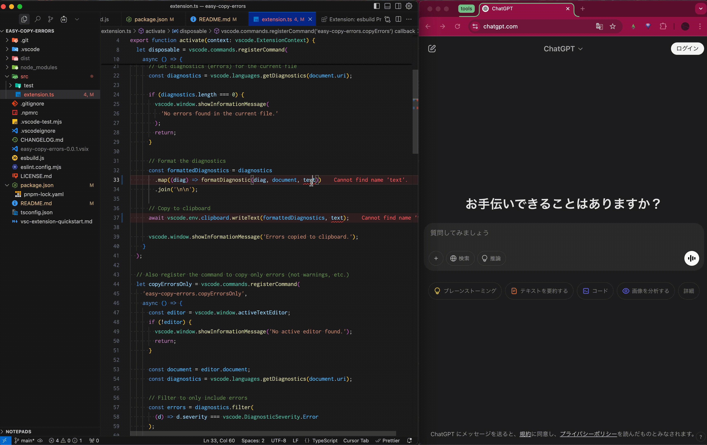

# 📋 Easy Copy Errors

[English](README.md) | [日本語](README.ja.md)

A VS Code extension that makes it easy to copy error messages from the current file. Optimized for creating prompts for generative AI tools (like ChatGPT, GitHub Copilot, etc.)!


## 🌟 Features

- 🔴 Copy all diagnostic information (errors, warnings, etc.) from the current file
- 🚨 Copy only errors (excluding warnings, etc.)
- ✨ Provide error information in a format optimized for AI tools
- 🔧 Customize the format of copied error messages

## 🚀 Usage

- Copy all diagnostic information: `Ctrl+Alt+E` (`Cmd+Option+E` on Mac)
- Copy only errors: `Ctrl+Alt+A` (`Cmd+Option+A` on Mac)

You can also run these commands from the Command Palette (`Ctrl+Shift+P` or `Cmd+Shift+P`):
- "Copy All Errors in Current File"
- "Copy Only Errors in Current File"

## ⚙️ Configuration

This extension offers the following configuration options:

- `easyCopyErrors.includeFileName`: Include the file name in the copied error message (default: `true`)
- `easyCopyErrors.format`: Format of the error message (default: `"[${severity}] Line ${line}, Column ${column}: ${message}"`)

### 📝 Available placeholders for formatting

- `${severity}`: Severity of the diagnostic (Error, Warning, Info, Hint)
- `${line}`: Line number where the diagnostic appears
- `${column}`: Column number where the diagnostic appears
- `${message}`: Diagnostic message
- `${file}`: File name (only included if `includeFileName` is `true`)
- `${lineContent}`: Content of the code line where the error occurs
- `${relativePath}`: Relative path from the workspace

## 🤖 Integration with Generative AI

This extension is extremely useful when communicating error details to generative AI tools like ChatGPT or GitHub Copilot, as it copies error information in a structured format.

### ✅ Example of copied format

```
file: src/components/Button.tsx
Line 42:      return {label}
Property 'handlClick' does not exist. Did you mean 'handleClick'? ts(2551)
```

Using this format, AI can accurately understand the error location and context, enabling it to suggest more precise solutions.

### 💡 Example question for AI

```
Please help me solve the following TypeScript error:

file: src/components/Button.tsx
Line 42:      return {label}
Property 'handlClick' does not exist. Did you mean 'handleClick'? ts(2551)
```

## 📚 Motivation for using this extension

### 🧠 Make generative AI smarter

The performance of generative AI heavily depends on the context provided. By including the exact file, line number, and code content where the error occurs, AI can understand the problem more accurately and suggest better solutions.

### ⏱️ Save development time

Save time manually copying and pasting error details. With just one keyboard shortcut, all necessary information is copied to your clipboard.

## 📜 License

Released under the MIT license. For details, see the [LICENSE](LICENSE.md) file.

## 🔄 Version History

### Version 0.0.1
- 🎉 Initial release
- 🔄 Implementation of basic features
